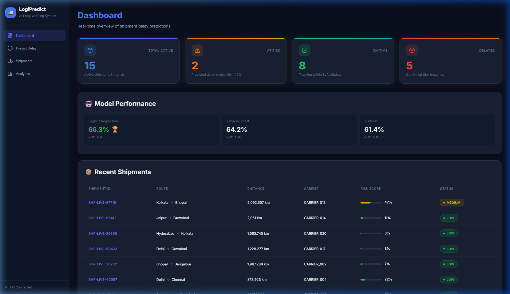
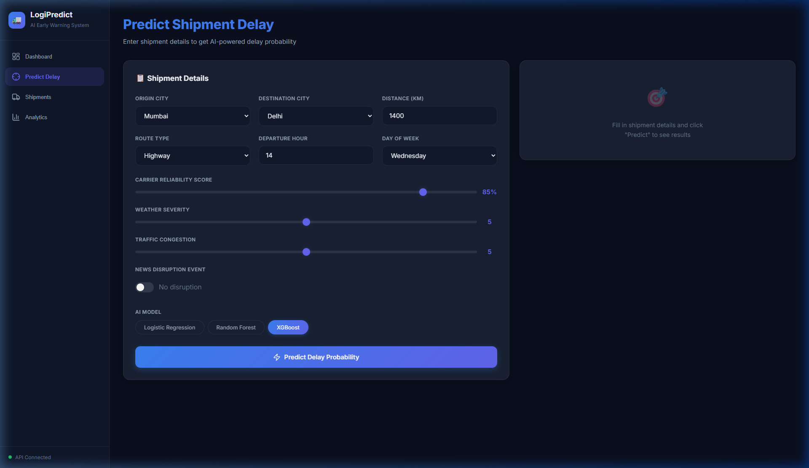
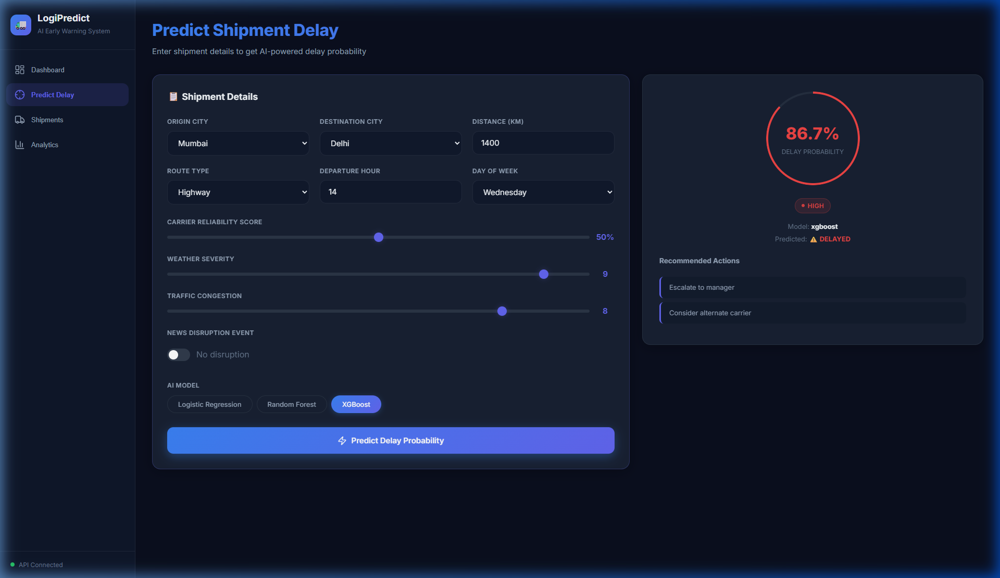
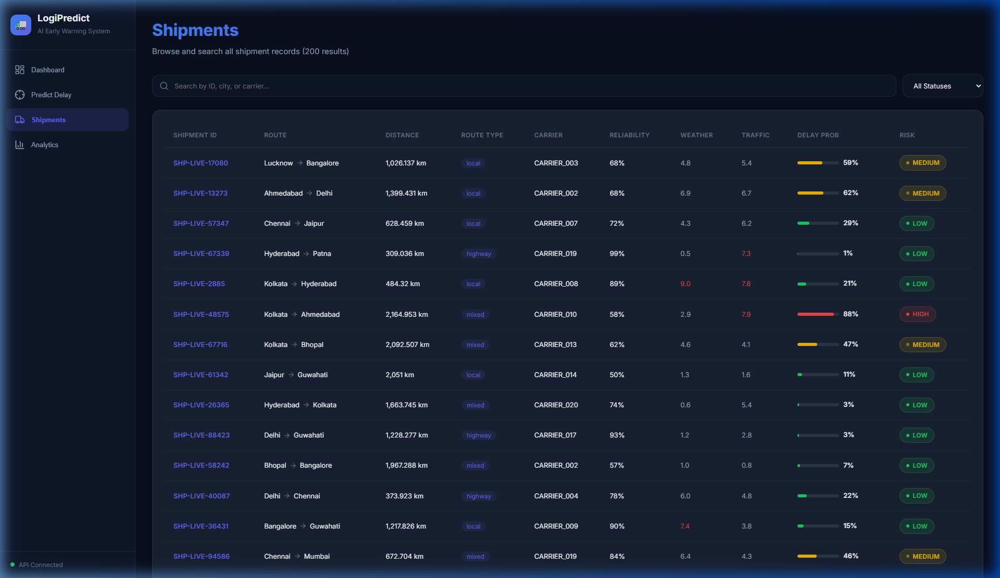
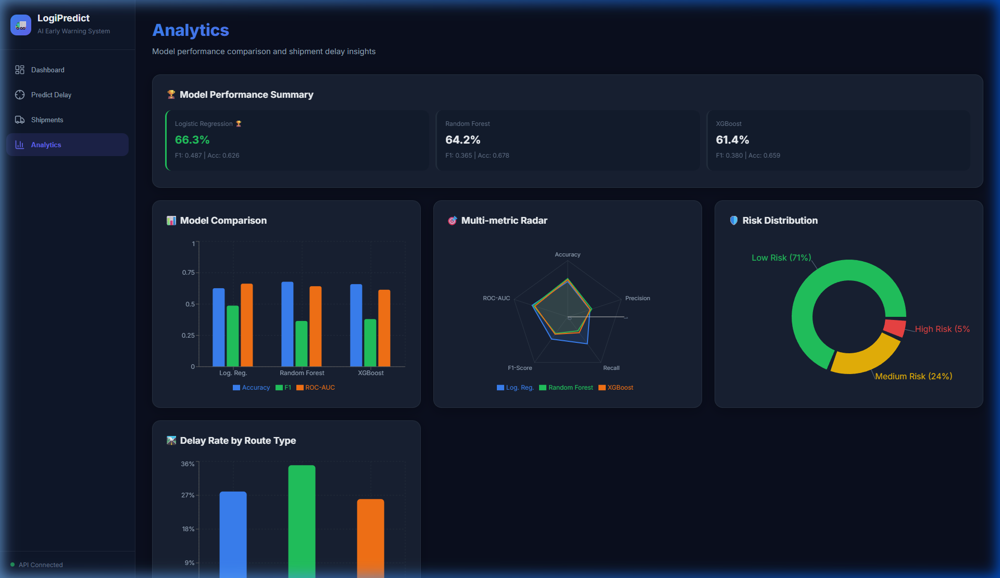

# 🚛 LogiPredict — AI Early Warning System for Shipment Delays

> An AI-powered logistics system that predicts shipment delays **before they happen**, using Machine Learning to analyze weather, traffic, carrier reliability, and route conditions — enabling proactive decision-making instead of reactive firefighting.


---

## 🎯 The Problem

In logistics, shipment delays are typically discovered **after** they've already happened — leading to:
- 😡 Angry customers and lost trust
- 💸 Financial penalties from SLA (Service Level Agreement) breaches
- 📉 Operational chaos from last-minute scrambling

**This system flips the script:** instead of reacting to delays, it **predicts them in advance** so teams can take preventive action.

---

## ✨ What It Does

| Feature | Description |
|---------|-------------|
| 🔮 **Delay Prediction** | Predicts delay probability (0-100%) for any shipment before dispatch |
| 🤖 **3 ML Models** | Compares Logistic Regression, Random Forest, and XGBoost |
| 📊 **Live Dashboard** | Real-time React dashboard with KPI cards, charts, and risk indicators |
| 🎯 **Risk Classification** | Categorizes shipments as LOW / MEDIUM / HIGH risk with actionable recommendations |
| 📈 **Analytics** | Model comparison charts, risk distribution pie charts, route delay analysis with Recharts |
| 🔄 **Live Data Stream** | Simulated real-time shipment generation with auto-prediction every 5 seconds |
| 🚨 **Smart Recommendations** | Context-aware actions: reroute, switch carrier, notify customer, or escalate |
| 🗄️ **Full API** | RESTful FastAPI backend with CORS, health checks, and structured responses |
| 🐳 **Docker Ready** | Dockerfile + docker-compose for one-command deployment |
| 🧪 **Test Suite** | Unit and integration tests for API and ML pipeline |

---

## 📸 Screenshots & Demo

### 🏠 Dashboard — Real-Time Overview
Live KPI cards showing active, at-risk, on-time, and delayed shipments. Model performance comparison and a live-updating shipments feed.



---

### 🎯 Predict Delay — AI-Powered Prediction
Interactive form with city selectors, sliders for weather/traffic/carrier reliability, model picker (Logistic Regression, Random Forest, XGBoost), and instant prediction with an animated risk gauge.



---

### 🔴 Prediction Result — High Risk Detected (86.7%)
When a shipment has bad weather (9/10), high traffic (8/10), and low carrier reliability (50%), the AI predicts an **86.7% delay probability** with HIGH risk classification and recommended actions.



---

### 📋 Shipments — Searchable Records
Browse all 200+ shipment records with search, filter by risk level, pagination, and color-coded risk indicators. Auto-refreshes every 5 seconds with live data.



---

### 📈 Analytics — Model Comparison & Insights
Model comparison bar charts, multi-metric radar plots, risk distribution donut chart, and delay rate analysis by route type — all powered by Recharts.



---

## 🧠 How It Works

```
┌─────────────────────────────────────────────────────────────────┐
│  📦 Shipment Data (10,000 records)                              │
│  Origin, Destination, Distance, Weather, Traffic, Carrier...   │
└──────────────────────┬──────────────────────────────────────────┘
                       ▼
┌──────────────────────────────────────────────────────────────────┐
│  🔧 Preprocessing Pipeline                                      │
│  StandardScaler (numeric) + OneHotEncoder (categorical)         │
│  8 numeric features + ~30 one-hot encoded → ~40 total features  │
└──────────────────────┬──────────────────────────────────────────┘
                       ▼
┌──────────────────────────────────────────────────────────────────┐
│  🤖 ML Training (3 models trained on 80% data)                   │
│  ├── Logistic Regression (baseline)                              │
│  ├── Random Forest (non-linear patterns)                         │
│  └── XGBoost (gradient-boosted trees)                            │
└──────────────────────┬──────────────────────────────────────────┘
                       ▼
┌──────────────────────────────────────────────────────────────────┐
│  📊 Evaluation (tested on 20% held-out data)                     │
│  Accuracy, Precision, Recall, F1-Score, ROC-AUC                 │
│  Winner crowned 🏆 based on ROC-AUC score                       │
└──────────────────────┬──────────────────────────────────────────┘
                       ▼
┌──────────────────────────────────────────────────────────────────┐
│  🌐 FastAPI Backend (serves predictions via HTTP)                │
│  /predict → delay probability + risk level + recommendations    │
│  /shipments → browse all records     /analytics → charts data   │
└──────────────────────┬──────────────────────────────────────────┘
                       ▼
┌──────────────────────────────────────────────────────────────────┐
│  💻 React Dashboard (Vite + Recharts)                            │
│  Dashboard | Predict Delay | Shipments | Analytics               │
└──────────────────────────────────────────────────────────────────┘
```

### Prediction Input Features

| Feature | Description | Range |
|---------|-------------|-------|
| `origin` / `destination` | Indian cities (14 cities) | Mumbai, Delhi, Bangalore... |
| `distance_km` | Shipment distance | 200 – 2,500 km |
| `route_type` | Road type | Highway, Local, Mixed |
| `departure_hour` | Hour of departure | 0 – 23 |
| `day_of_week` | Day (0=Mon, 6=Sun) | 0 – 6 |
| `carrier_reliability_score` | Carrier track record | 0.0 – 1.0 |
| `weather_severity` | Weather conditions | 0 (clear) – 10 (extreme) |
| `traffic_congestion` | Road congestion level | 0 (free) – 10 (gridlock) |
| `has_news_disruption` | Strikes, road blocks, etc. | 0 or 1 |

### Risk Classification Output

| Risk Level | Probability | Action |
|------------|-------------|--------|
| 🟢 **LOW** | < 40% | Standard tracking |
| 🟡 **MEDIUM** | 40% – 69% | Monitor closely, notify receiver |
| 🔴 **HIGH** | ≥ 70% | Escalate to manager, consider alternate carrier |

---

## 🏗️ Project Structure

```
ML_model_01/
├── api/                          # Lightweight prediction API
│   └── app.py                    # FastAPI app with all endpoints
├── app/                          # Production backend (extended)
│   ├── main.py                   # App factory + lifespan
│   ├── config.py                 # Settings from .env
│   ├── database.py               # SQLAlchemy setup
│   ├── auth/                     # JWT authentication
│   │   ├── dependencies.py       # Auth guards
│   │   ├── router.py             # Register/login endpoints
│   │   └── service.py            # Token management
│   ├── models/                   # ORM models (5 tables)
│   │   ├── shipment.py
│   │   ├── prediction.py
│   │   ├── carrier.py
│   │   ├── alert.py
│   │   └── user.py
│   ├── schemas/                  # Pydantic request/response
│   ├── routers/                  # API endpoints (5 routers)
│   │   ├── predictions.py
│   │   ├── shipments.py
│   │   ├── carriers.py
│   │   ├── alerts.py
│   │   └── analytics.py
│   ├── services/                 # Business logic
│   │   ├── ml_service.py         # Model loading + inference
│   │   ├── weather_service.py    # Weather data (mock/real)
│   │   ├── traffic_service.py    # Traffic congestion patterns
│   │   ├── recommendation.py     # Smart action suggestions
│   │   └── cache_service.py      # In-memory / Redis caching
│   └── middleware/               # Logging + rate limiting
├── ml/                           # ML explainability
│   └── explainer.py              # SHAP TreeExplainer
├── src/                          # ML pipeline
│   ├── preprocessing.py          # Feature engineering + scaling
│   ├── train_models.py           # Train 3 ML models
│   └── evaluate.py               # Metrics, ROC curves, confusion matrices
├── data/                         # Dataset
│   ├── generate_dataset.py       # Synthetic data generator
│   └── shipments.csv             # 10,000+ shipment records
├── models/                       # Trained model files
│   ├── preprocessor.joblib       # Fitted sklearn preprocessor
│   ├── logistic_regression.joblib
│   ├── random_forest.joblib
│   └── xgboost.joblib
├── outputs/                      # Evaluation artifacts
│   ├── model_metrics.json        # Performance metrics (JSON)
│   ├── model_comparison.csv      # Side-by-side comparison
│   ├── confusion_matrices.png    # Confusion matrix plots
│   ├── roc_curves.png            # ROC curve comparison
│   └── feature_importance_*.png  # Feature importance charts
├── frontend/                     # React + Vite dashboard
│   └── src/
│       ├── pages/
│       │   ├── Dashboard.jsx     # KPI cards, model perf, recent shipments
│       │   ├── Predict.jsx       # Interactive prediction form
│       │   ├── Shipments.jsx     # Searchable shipment table (paginated)
│       │   └── Analytics.jsx     # Charts: bar, radar, pie, route stats
│       └── components/
│           ├── Sidebar.jsx       # Navigation + API status indicator
│           ├── KPICard.jsx       # Metric display cards
│           └── RiskBadge.jsx     # Color-coded risk labels
├── tests/                        # Test suite
│   ├── conftest.py               # Shared fixtures
│   ├── test_api.py               # API endpoint tests
│   ├── test_ml_pipeline.py       # ML pipeline tests
│   └── test_predictions.py       # Prediction accuracy tests
├── main.py                       # Run complete ML pipeline
├── requirements.txt              # Python dependencies
├── Dockerfile                    # Multi-stage Docker build
├── docker-compose.yml            # App + Redis orchestration
├── .env.example                  # Environment variables template
└── .gitignore
```

---

## 🚀 Quick Start

### Prerequisites
- Python 3.11+
- Node.js 18+ (for frontend)
- pip

### 1. Clone & Install

```bash
git clone https://github.com/Myparadox-creator/ML_model_01.git
cd ML_model_01

# Backend dependencies
pip install -r requirements.txt

# Frontend dependencies
cd frontend
npm install
cd ..
```

### 2. Train ML Models (first time only)

```bash
python main.py
```

This runs the complete pipeline:
1. Generates 10,000 synthetic shipment records → `data/shipments.csv`
2. Preprocesses and splits data (80/20)
3. Trains 3 models → `models/*.joblib`
4. Evaluates and generates charts → `outputs/`

### 3. Start the Backend API

```bash
uvicorn api.app:app --reload --port 8000
```

Visit **http://localhost:8000/docs** for the interactive Swagger UI.

### 4. Start the Frontend

```bash
cd frontend
npm run dev
```

Visit **http://localhost:5173** for the dashboard.

### 5. Try a Prediction

```bash
curl -X POST http://localhost:8000/predict \
  -H "Content-Type: application/json" \
  -d '{
    "origin": "Mumbai",
    "destination": "Kolkata",
    "distance_km": 2050,
    "route_type": "local",
    "departure_hour": 8,
    "day_of_week": 5,
    "is_weekend": 1,
    "carrier_reliability_score": 0.52,
    "weather_severity": 9.0,
    "traffic_congestion": 8.5,
    "has_news_disruption": 1
  }'
```

**Response:**
```json
{
  "delay_probability": 0.87,
  "risk_level": "HIGH",
  "predicted_delayed": true,
  "model_used": "xgboost",
  "recommended_actions": [
    "Escalate to manager",
    "Consider alternate carrier"
  ]
}
```

---

## 🐳 Docker Deployment

```bash
# Copy environment config
cp .env.example .env

# Start all services
docker-compose up -d

# App:   http://localhost:8000
# Redis: localhost:6379 (optional caching)
```

---

## 📊 ML Model Performance

Trained on 10,000 synthetic shipment records, evaluated on 20% held-out test set:

| Model | Accuracy | Precision | Recall | F1-Score | ROC-AUC |
|-------|----------|-----------|--------|----------|---------|
| Logistic Regression | 0.6265 | 0.4147 | 0.5907 | 0.4873 | **0.6627** 🏆 |
| Random Forest | 0.6780 | 0.4479 | 0.3078 | 0.3649 | 0.6423 |
| XGBoost | 0.6590 | 0.4188 | 0.3478 | 0.3800 | 0.6143 |

> **Note:** These metrics are from synthetic data. With real-world logistics data and hyperparameter tuning, significantly higher accuracy is expected.

---

## 🔑 API Endpoints

### Prediction API (`api/app.py`)

| Method | Endpoint | Description |
|--------|----------|-------------|
| `GET` | `/health` | Health check + loaded models |
| `GET` | `/shipments?limit=200` | Get recent shipments with predictions |
| `GET` | `/model-info` | Model performance metrics |
| `GET` | `/analytics` | Risk distribution + route delay stats |
| `POST` | `/predict` | **Submit shipment → get delay prediction** |

### Production API (`app/main.py`) — Extended

| Method | Endpoint | Description |
|--------|----------|-------------|
| `POST` | `/auth/register` | Register new user |
| `POST` | `/auth/login` | Get JWT token |
| `POST` | `/api/v1/predict` | Predict with auth |
| `GET` | `/api/v1/predictions` | Prediction history |
| `POST` | `/api/v1/shipments` | Create shipment record |
| `GET` | `/api/v1/shipments` | List all shipments |
| `GET` | `/api/v1/carriers` | List carriers |
| `GET` | `/api/v1/alerts` | View high-risk alerts |
| `POST` | `/api/v1/alerts/{id}/resolve` | Resolve an alert |
| `GET` | `/api/v1/analytics/dashboard` | Dashboard summary data |
| `GET` | `/api/v1/analytics/weather/{city}` | City weather data |
| `GET` | `/api/v1/analytics/traffic` | Traffic congestion data |

---

## 💻 Frontend Pages

| Page | Features |
|------|----------|
| **Dashboard** | Live KPI cards (Active, At Risk, On-Time, Delayed), model performance summary, recent shipments table with risk bars |
| **Predict Delay** | Interactive form with city selectors, sliders for weather/traffic/reliability, model picker, instant prediction with animated gauge |
| **Shipments** | Full searchable table (200 records), filter by risk level, pagination, real-time updates every 5s |
| **Analytics** | Model comparison bar chart, multi-metric radar chart, risk distribution donut chart, route delay rate chart |

---

## 🧪 Testing

```bash
# Run all tests
python -m pytest tests/ -v

# With coverage report
python -m pytest tests/ --cov=app --cov=ml --cov-report=term-missing
```

---

## ⚙️ Configuration

Copy `.env.example` to `.env` and configure:

| Variable | Default | Description |
|----------|---------|-------------|
| `DATABASE_URL` | `sqlite:///./shipment_delay.db` | Database connection string |
| `JWT_SECRET_KEY` | `change-me` | JWT signing secret (change in production!) |
| `REDIS_ENABLED` | `false` | Enable Redis caching |
| `REDIS_URL` | `redis://localhost:6379/0` | Redis connection string |
| `OPENWEATHER_API_KEY` | *(empty)* | OpenWeatherMap API key for real weather |
| `RATE_LIMIT_PER_MINUTE` | `100` | API rate limit per IP |

---

## 🛠️ Tech Stack

| Layer | Technology |
|-------|-----------|
| **ML** | scikit-learn, XGBoost, pandas, numpy, SHAP |
| **Backend** | FastAPI, Uvicorn, SQLAlchemy, Pydantic |
| **Frontend** | React 18, Vite, Recharts, Lucide Icons |
| **Database** | SQLite (dev) / PostgreSQL (prod) |
| **Caching** | In-memory (dev) / Redis (prod) |
| **Auth** | JWT (python-jose + bcrypt) |
| **Deployment** | Docker, docker-compose |
| **Testing** | pytest, httpx |

---

## 📝 Important Notes

- **Data is synthetic**: The 10,000 shipment records are generated with realistic patterns but are not from a real logistics company. For production use, replace `data/generate_dataset.py` with real historical data.
- **Live generator is simulated**: The backend generates a new fake shipment every 5 seconds to simulate real-time data flow. In production, this would connect to an actual logistics ERP or tracking system.
- **Models can be improved**: With real data, proper feature engineering, and hyperparameter tuning, significantly better performance is achievable.

---

## 📄 License

MIT

---

## 👤 Author

**Aditya Ranjan**
- GitHub: [@Myparadox-creator](https://github.com/Myparadox-creator)
- Email: adityaranjanwxd@gmail.com
