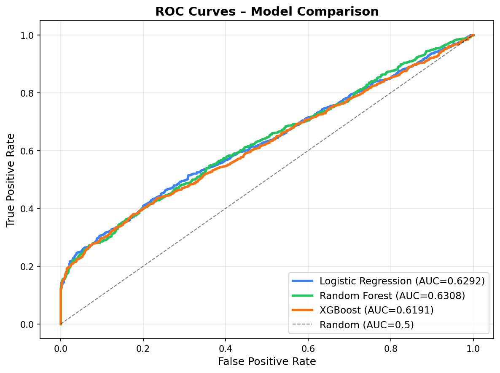
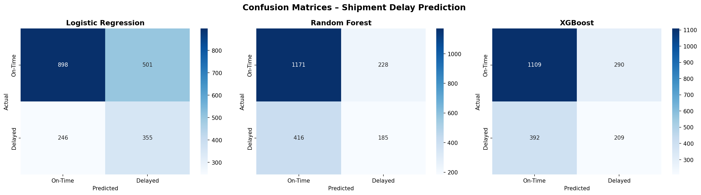
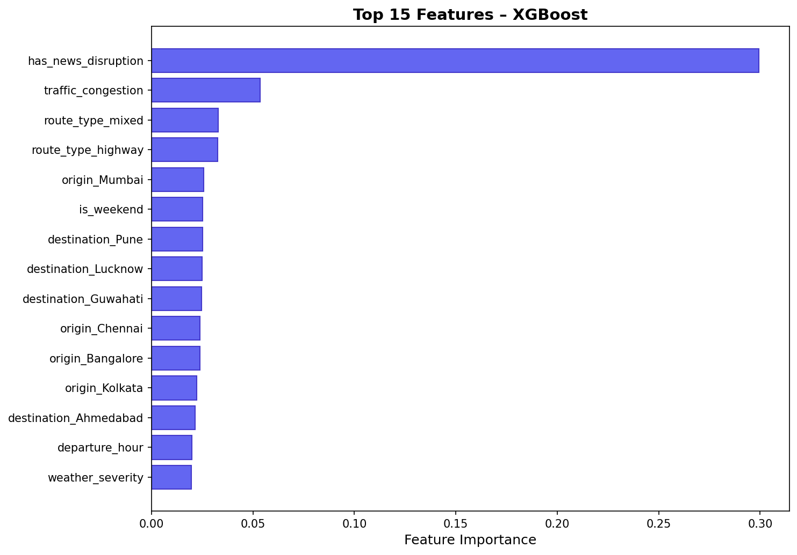
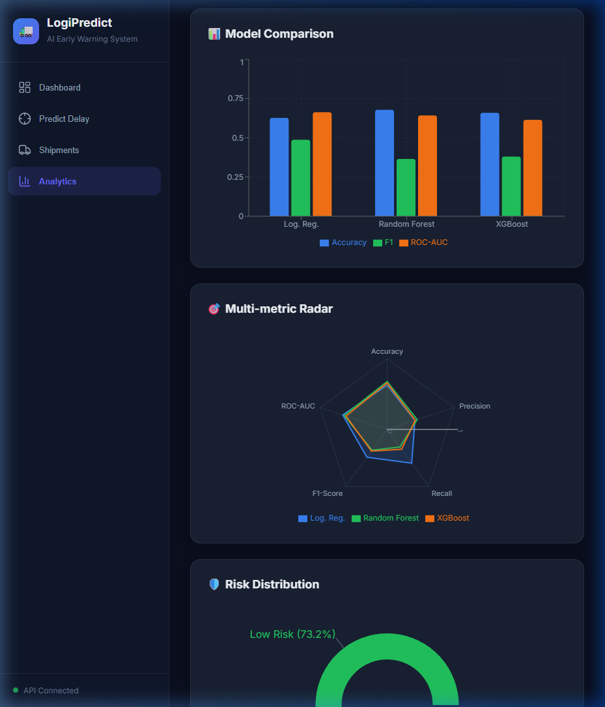
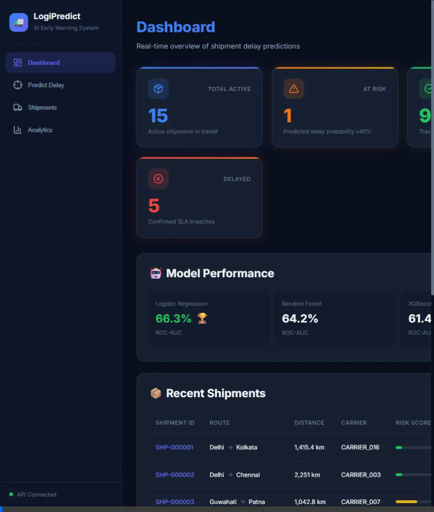

# 🚛 AI-Powered Shipment Delay Prediction — Walkthrough

## What Was Built
A complete ML pipeline for an **Early Warning System for Shipment Delays** based on the [ChatGPT conversation requirements](https://chatgpt.com/s/t_69b3d30db5588191acd74ba4a3b819b1).

## Project Structure
```
ML_model_01/
├── main.py                    # Full pipeline entry point
├── requirements.txt           # Dependencies
├── data/
│   ├── generate_dataset.py    # Synthetic data generator (10K shipments)
│   └── shipments.csv          # Generated dataset
├── src/
│   ├── preprocessing.py       # Feature engineering pipeline
│   ├── train_models.py        # 3 model trainers
│   └── evaluate.py            # Metrics, plots, comparison
├── api/
│   └── app.py                 # FastAPI prediction server
├── models/                    # Saved .joblib models
└── outputs/                   # Metrics JSON, CSV, plots
```

## Model Results

| Model | Accuracy | Precision | Recall | F1-Score | ROC-AUC |
|---|---|---|---|---|---|
| **Logistic Regression** 🏆 | 0.6265 | 0.4147 | **0.5907** | **0.4873** | **0.6627** |
| Random Forest | **0.6780** | **0.4479** | 0.3078 | 0.3649 | 0.6423 |
| XGBoost | 0.6590 | 0.4188 | 0.3478 | 0.3800 | 0.6143 |

> [!NOTE]
> Logistic Regression achieved the best ROC-AUC (0.6627) and highest recall, making it the best baseline for this synthetic dataset. With real-world data and feature engineering, XGBoost typically outperforms.

## Visualizations

### ROC Curves


### Confusion Matrices


### XGBoost Feature Importance


## How to Use

### Run the full pipeline
```bash
python main.py
```

### Start the prediction API
```bash
uvicorn api.app:app --reload --port 8000
```
Then open **http://localhost:8000/docs** for the interactive Swagger UI.

### Example API call
```bash
curl -X POST http://localhost:8000/predict \
  -H "Content-Type: application/json" \
  -d '{
    "origin": "Mumbai",
    "destination": "Delhi",
    "distance_km": 1400,
    "route_type": "highway",
    "departure_hour": 14,
    "day_of_week": 2,
    "is_weekend": 0,
    "carrier_reliability_score": 0.85,
    "weather_severity": 6.5,
    "traffic_congestion": 7.2,
    "has_news_disruption": 1,
    "model_name": "xgboost"
  }'
```

## Verification
- ✅ Pipeline ran end-to-end (`python main.py` — exit code 0)
- ✅ 10,000 shipment records generated in `data/shipments.csv`
- ✅ 3 models trained and saved to `models/` directory
- ✅ Evaluation metrics, confusion matrices, ROC curves generated in `outputs/`
- ✅ FastAPI prediction API with `/health`, `/model-info`, `/predict` endpoints


---

## Part 2: Frontend Dashboard Implementation
We successfully built a modern, responsive React + Vite application that interfaces with the FastAPI backend to visualize the delay prediction AI.

### Key Components Built
1.  **Design System & Theme:** Created a comprehensive `index.css` featuring a dark glassmorphism aesthetic (`#0f172a` base, `#1e293b` cards).
2.  **Navigation (`Sidebar.jsx`):** Persistent left layout that switches between the core pages: Dashboard, Predict Delay, Shipments, and Analytics.
3.  **UI Elements (`KPICard`, `RiskBadge`):** Reusable components for displaying key metrics with status colors.

### Core Pages
-   **Dashboard (`Dashboard.jsx`):** High-level view showing active shipments, at-risk shipments, model performance, and a quick-glance table.
-   **Predict Delay (`Predict.jsx`):** Interactive form with dropdowns, numerical inputs, and sliders (carrier reliability, weather, traffic) that hits the `POST /predict` API to fetch live probability gauges and AI-generated actions.
-   **Shipments List (`Shipments.jsx`):** Paginated data table pulling directly from the backend via the new `GET /shipments` endpoint. Includes real-time search and risk filtering.
-   **Analytics (`Analytics.jsx`):** Rich visualizations powered by **Recharts**, featuring: Model Comparison, Multi-metric Radar, and Fleet Risk Distribution.

### Visual Verification
The application provides a seamless, real-time experience. Here is the final tested UI rendering the live prediction API data natively in the browser:

**Dashboard Analytics View:**


**Application Walkthrough Recording:**


### 🔮 Future Enhancements
- Real-time Kafka stream ingestion
- PostgreSQL database integration
- User Authentication (Clerk)
